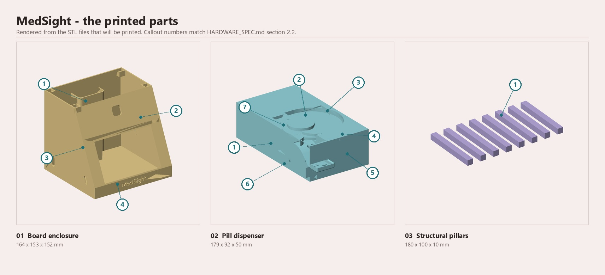
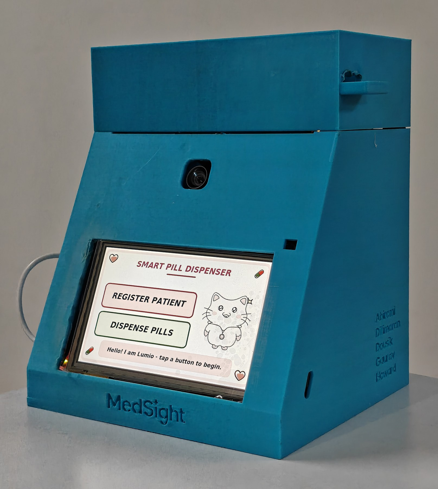
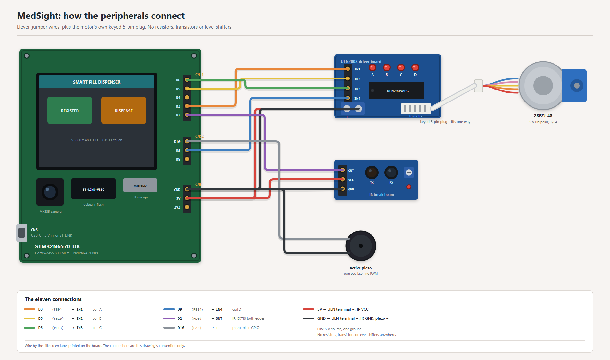
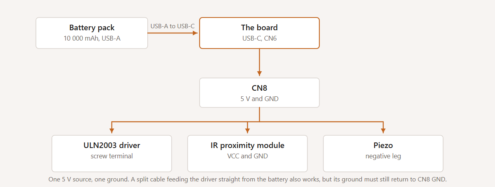

# The hardware, part by part

Parts, wiring, bill of materials, specifications and the order to power things
up in.

---

## 1. The annotated view

*The three printed assemblies. Callout numbers resolve to the tables in
section 2.*

*The assembled unit. The camera sits above the screen, the collection drawer is
at the lower right, and the five names on the side panel are the people who
built it.*

---

## 2. Parts, by callout number

Every number in the annotated view resolves to a row here. The board's own
components are listed too, so that what was used and what was merely present
are both visible.

### 2.1 Electronics

| # | Part | Manufacturer / part number | Qty | Function | Source |
|---|---|---|---|---|---|
| **1** | STM32N6570-DK Discovery kit | STMicroelectronics, **STM32N6570-DK** (MCU: STM32N657X0H3Q) | 1 | The whole computer: Cortex-M55 at 800 MHz, Neural-ART NPU at 1 GHz, ~4.2 MB on-chip SRAM. Runs µT-Kernel 3.0 and all four networks. | Supplied by the contest for round 2 |
| **2** | 5" LCD with integrated capacitive touch | **RK050HR18** panel + **GT911** touch controller (both on the DK) | 1 | The entire user interface: 22 screens at 800×480 RGB565, scanned out by the LTDC. Touch on I2C2 (PD14/PD4). | On the DK board |
| **3** | Camera module | **IMX335** sensor on ST's MB1854 / B-CAMS-IMX bundle, via DCMIPP + CSI | 1 | Face capture for recognition and enrolment; the intake watch during the confirm screen. | Shipped with the DK |
| **4** | microSD card | any FAT32 card, on the DK's SDMMC2 slot | 1 | The only storage: patient gallery `patients.dat`, append-only `events.log`, carer passcode hash `carer.cfg`. **Nothing leaves this card.** | User-supplied |
| **5** | Stepper motor | **28BYJ-48**, 5 V, unipolar, 1/64 geared | 1 | Turns the turntable. Driven in a half-step sequence; each half-step is one atomic `BSRR` write. | Sold as a pair with (6) |
| **6** | Darlington driver board | **ULN2003A** on the common 4-LED breakout | 1 | Switches the four motor coils from four 3.3 V GPIO lines. The four channel LEDs are a free bring-up indicator. | ships with (5) |
| **7** | IR proximity module | 3-pin digital module, **`OUT` not analog** | 1 | Counts each pill as it physically passes. This is the sensor the whole dispense loop closes around - the progress bar is a readout of this interrupt, not a timer. | generic |
| **8** | Piezo buzzer | **active** piezo element (contains its own oscillator) | 1 | Five alert patterns. Driven by plain push-pull GPIO, DC switched - no PWM, no timer channel, no transistor, no resistor. | generic |
| **9** | Jumper wires | female-to-female | **11** | The entire wiring harness. **No resistors, no transistors, no level shifters, no external regulator.** Buy 14 - they are sold in packs and they break | generic |
| **10** | USB-C cable + 5 V supply | any; a 10 000 mAh / 22.5 W USB battery pack was used | 1 | Single supply for board, driver and sensor. One 5 V source, one ground. | generic |

**Why there are no external passives.** An early design called for pull-down
resistors on the ULN2003 inputs. Checking TI's datasheet **SLRS027T** section 7.2-7.3
showed the ULN2003A has an **internal input network** - 2.7 kΩ series plus
7.2 kΩ/3 kΩ base-emitter pull-downs - so the inputs do not float. The
requirement was dropped, and the bill of materials is the shorter for it.

### 2.2 Printed and mechanical parts

Three printed assemblies. Every dimension is the STL bounding box.

#### 01 - Board enclosure · 164 × 153 × 152 mm · 10,766 triangles

Houses the STM32N6570-DK and presents the 5" screen at a readable angle. The
sloped front face is the reason the device reads as an appliance rather than a
dev board on a desk.

| # | Part | Function |
|---|---|---|
| **1** | Outer housing shell | The main enclosure body, with sloped structural walls |
| **2** | Port / connector grid | A grid of circular openings on the side wall for the I/O the board needs to reach - USB-C, the jumper harness out to the dispenser |
| **3** | Battery compartment | Rear-mounted cuboid recess for the battery pack. **This is what makes standalone operation a product feature rather than a demo**: the battery lives inside the device rather than trailing from it |
| **4** | MedSight brand plate | Embossed panel on the front base face |

#### 02 - Pill dispenser · 179 × 92 × 50 mm · 5,136 triangles

The mechanism. One turntable, one medication - which is where classification
happens in this device, mechanically rather than by vision.

| # | Part | Function |
|---|---|---|
| **1** | Outer enclosure box | Rectangular housing, open at the top over the turntable |
| **2** | Rotating pill carousel | The disc, with a helical pill track. Mounted on the 28BYJ-48 and driven half-step |
| **3** | Central drive motor hub | The spindle at the centre, coupling the stepper to the carousel |
| **4** | Dispensing chute | The exit channel to the collection drawer. **The chute geometry is what makes the IR counter work**: pills *slide* rather than free-fall, which is why detection pulses measure 17-46 ms instead of the few milliseconds a drop would give - and a driver sized for a free-fall would have discarded every real pill |
| **5** | Output collection drawer | The external box the dose arrives in |
| **6** | Side sensor brackets ×2 | Mounts that hold the infrared proximity module square to the chute at a repeatable height and standoff, which is what makes one pill's pulse look like the next one's |
| **7** | Internal divider wall | Vertical partition separating the mechanism from the pill storage volume |

#### 03 - Structural pillars · 180 × 100 × 10 mm · 8 off

| # | Part | Function |
|---|---|---|
| **1** | Structural pillar ×8 | Hollow rectangular-section beams forming the frame that carries the enclosure and the dispenser as one assembly |

### 2.3 The mechanism, and the stacked-module design it belongs to

**The turntable was designed and built by the team.** A small turntable with
passive guides singulates loose, unsorted pills into a single-file row, pushes
that row past an infrared proximity sensor, and drops counted pills down a chute. Pills
go in loose; the guides do the sorting mechanically, so there is no per-pill
compartment to align.

**One reflective sensor, with the threshold in hardware.** The module is a
reflective infrared proximity sensor: a pill passing in front of it returns
enough light to pull the output low, and because the output is digital the
in-or-out decision is made in the sensor rather than in software. One module
also means one alignment to hold rather than a facing pair to keep square.

**What that costs, stated rather than skipped.** How strongly a pill returns
light depends on its colour and finish, so this is not a sensor that is
indifferent to what is being counted. That is precisely why the discrimination
floor was set from measured pulse durations on the bench rather than assumed,
and why the counter is bounded by time since the last counted pill rather than
by an expected pulse shape.

**The stepper is a 28BYJ-48 through a ULN2003A**, driven directly in a half-step
coil sequence rather than through a STEP/DIR driver IC. It is cheap, it draws
little, it needs four GPIO lines, and it is trivial to duplicate per module.

#### The stacked-module architecture, which is design intent and not built

One module is built and works. The intended product is **six to eight
stacked independent dispensing modules**, each a duplicate of the one that exists, all
dropping into **one shared chute** so the patient collects a dose from a single
place.

Stacked independent modules were chosen over one larger multi-position carousel
for a reason that was about the deadline as much as the engineering: **you can
build two today and six later without redesigning anything.** A single large
carousel has to be built to full capacity before it is useful at all, its
capacity is fixed at print time, and one jam stops every medication rather than
one. The dispense API already takes a count and returns what was actually
counted, so adding a `module_id` is additive.

Turntable and guide geometry is the one part that is *not* copy-paste between
modules, because different medications have different pill sizes.

**The CAD files are in [`hardware/cad/`](../hardware/cad/)**, one STL and one
STEP per printed part: the STL is what a reader prints, the STEP is what a
reader can open and change. The print settings actually used are recorded in
`hardware/cad/README.md`. What is still missing there is a fastener list.

---

## 3. Interface and connector map

Wire by the **silkscreen label** printed next to each pin - that is the only
labelling that is unambiguous with a jumper in your hand. The MCU-pin column
exists so the table can be checked against `dispenser.c` and `buzzer.c`.

| Function | Silkscreen | Header | MCU pin | I/O domain |
|---|---|---|---|---|
| ULN2003 `IN1` - coil A | `D3` | CN11 | PE9 | VDDIO5 |
| ULN2003 `IN2` - coil B | `D5` | CN11 | PE10 | VDDIO5 |
| ULN2003 `IN3` - coil C | `D6` | CN11 | PE13 | VDDIO5 |
| ULN2003 `IN4` - coil D | `D9` | CN12 | PE14 | VDDIO5 |
| IR module `OUT` | `D2` | CN11 | PD0 (**EXTI0**, both edges) | main VDD |
| Piezo `+` | `D10` | CN12 | PA3 | main VDD |
| 5 V and GND for both modules | `5V` / `GND` | CN8 | - | - |

**Pins that must stay unwired:**

| Pin | MCU pin | Why |
|---|---|---|
| `D14` | PC1 | camera I2C1 SDA - in use |
| `D15` | PH9 | camera I2C1 SCL - in use |

*Eleven jumper wires, plus the motor's own keyed 5-pin plug. Wire by the
silkscreen label - the colours above are the drawing's own convention. Generated
from the table above by `submission/render_wiring.py`, so the two cannot
disagree.*

Power path: section 9. Bring-up order: section 10.

---

## 4. Specifications

| | |
|---|---|
| **Processor** | Arm Cortex-M55 @ 800 MHz, STM32N657X0H3Q |
| **AI accelerator** | ST Neural-ART NPU @ 1 GHz, ~600 GOPS INT8 |
| **Networks running on it** | **4** - CenterFace (face detection), MobileFaceNet (face embedding), MediaPipe hand landmarks 224×224 INT8, YOLOv8n single-class pill detector 160×160 INT8 |
| **On-chip memory** | ~4.2 MB AXI SRAM in six banks; 220 KB proven NPU-reachable arena at `0x34388000` |
| **External memory** | 1 Gbit Octo-SPI NOR (NPU weights, four regions) · 256 Mbit Hexadeca-SPI PSRAM (activation scratch, camera frames) |
| **Firmware footprint (Debug)** | `.text` 561,324 · `.rodata` 334,456 · `.data` 684 · `.bss` 656,488 B - **85.6%** of the code region (147 KB free), **63.0%** of the data region (378 KB free) |
| **RTOS** | µT-Kernel 3.0 BSP2, six tasks, rate-monotonic priorities |
| **CPU idle** | **~89.6%** of wall-clock time in `WFI`, waking ~980×/s |
| **Display** | 5" RK050HR18, **800 × 480, RGB565**, LTDC scan-out, single framebuffer at `0x34200000` |
| **Touch** | GT911 capacitive, I2C2 |
| **Camera** | Sony IMX335 via DCMIPP + CSI |
| **Storage** | microSD (SDMMC2), FAT32 via FatFs R0.15. **The only persistent storage in the device.** |
| **Clock** | Internal RTC on LSE, falling back to LSI; kept across resets in the backup domain. **No NTP - there is no network.** |
| **Actuator** | 28BYJ-48 unipolar stepper, 1/64 gearbox, driven **half-step**; `MS_STEP_PERIOD_MS` = **2 ms** per half-step |
| **Pill sensor** | 3-pin digital IR proximity on EXTI0, both edges timestamped in the ISR. Idle **HIGH**. Real pill pulses **17-46 ms**; contact chatter 0-1 ms; discrimination floor **8 ms** |
| **Dispense bound** | `MS_NO_PILL_TIMEOUT_MS` = **25 s** since the *last counted pill* - a working mechanism runs as long as it needs to; a stopped one is caught in one window |
| **Audio** | Active piezo, 5 patterns, DC-switched GPIO. No codec, no PWM |
| **Power input** | 5 V over USB-C (CN6). Board, driver and sensor from one supply, one ground |
| **Power consumption** | **not measured.** See section 6 |
| **Boot modes** | **A** - development boot over USB with UART log. **B** - standalone from external NOR: ST FSBL at `0x70000000`, MedSight signed `-t ssbl` at `0x70100000`. Verified running a complete dispense on battery with no laptop |
| **Connectivity** | **None in this build.** Wi-Fi, Ethernet and BLE are never initialised and no network stack is compiled in. A scope decision, not a principle - connectivity is planned work, `MEDSIGHT_HANDBOOK.md` section 6.8 |
| **Capacity** | **multiple patients**, 4 dose times each, 1-10 pills per dose, **1 turntable**. The gallery is sized by `MAX_PATIENTS` in `ai_vision.h`, 10 in this build; raising it costs gallery RAM and nothing else |
| **Printed part sizes** | Board enclosure **164 × 153 × 152 mm** · pill dispenser **179 × 92 × 50 mm** · structural pillars **180 × 100 × 10 mm** (8 off), read from the STL bounding boxes |
| **Assembled dimensions** | **165 x 169 x 204 mm** (W x D x H), tape measure against the assembled unit. 15 mm of the depth is the collection drawer, which stands proud of the body |
| **Mass** | **950 g**, assembled, turntable empty |
| **Turntable capacity** | **Not a fixed number, by the nature of the mechanism.** Pills lie loose in a single layer on an open turntable and the guides singulate them, so there is no point at which it fills and binds. How many go in depends on pill size and how tidily they are laid out |
| **Power-source jumper** | On the underside of the board, selecting `VIN`, `USB-C` or `STLK`. **USB-C** to run from the battery, **STLK** to build and flash over the debugger. Ships on USB-C |
| **Operating environment** | Indoor, mains or battery, room temperature. No environmental qualification of any kind has been performed |

**How these figures were obtained.** The envelope and the mass were measured
against the assembled unit, with a tape measure and kitchen scales. Capacity
was not measured, because the mechanism has no point at which it binds: pills
lie loose in one layer and the guides do the singulating, so any single number
would have to be invented in order to be stated.

---

## 5. Measured performance

Every number here was taken on the real board. Where a figure names a count of
trials, that count is the real one.

| Quantity | Value | How it was obtained |
|---|---|---|
| Face recognition, end to end | **209 ms**, identical to the millisecond across **four** captures with different faces and confidences | The invariance is the point: the Neural-ART runtime executes a fixed epoch schedule for a fixed input shape, so cost does not depend on image content |
| Failed capture | 1111 ms | three detector passes plus two 500 ms waits |
| Hand-landmark inference | **285-302 ms** | ST publishes 20.75 ms for this model - an all-internal figure; ~978 KB of our activations sit in PSRAM |
| Pill detector on the NPU | 8-bit integer, decode on the Cortex-M55, **matching its floating-point accuracy** | held-out validation |
| Dispense accuracy | 4 trials: 5/5, 3/3, 3/3, 2/2. All 13 pills counted, by the sensor rather than the motor. A small sample, and the mechanism has miscounted and jammed outside these trials | not a reliability figure |
| Longest *legitimate* detection pulse | **1210 ms** | the number that killed an earlier 1500 ms stall bound, which had left 290 ms of margin before it would have refused a dose that was being delivered correctly |
| Half-step period | 2 ms | smooth and silent under turntable load |
| Battery operation | 1 complete dispense, battery alone, no laptop | standalone boot |
| CPU idle | **~89.6%** in `WFI`; **7-50%** during an intake watch, which is 0.14% of a four-dose day - a daily average of ~87.9% | DWT cycle counts accumulated across the sleep, read out from a task on a 10-second period |

---

## 6. What is on the board and deliberately unused

The board carries more than this build uses. Each one, and why.

| Capability | Why it is unused |
|---|---|
| **Gigabit Ethernet** | Never initialised in this build, and no code path can transmit. Connectivity is planned work; `MEDSIGHT_HANDBOOK.md` section 6.8 |
| **USB data (device and host)** | Only ST-LINK debug and flashing are used. A USB data path would be a route off the device, which is the same argument as Ethernet. |
| **Wi-Fi / BLE** | Not present on the board and nothing is added to the BOM. A carer alert over Wi-Fi and a patient-worn band are the top of the roadmap, and both need a module this hardware does not have. |
| **SAI audio codec and MEMS microphone** | The one event that needs sound is a missed dose, and an active piezo on a GPIO does that for one wire and no code. A codec is neither needed nor in scope. `HAL_SAI_MODULE_ENABLED` is still commented out. |
| **The second XSPI / unused external NOR regions** | The NPU weights occupy four regions; the rest is unclaimed. Documented in `TECHNICAL_REFERENCE.md` section 8 so a future model has somewhere known to go. |
| **Power measurement** | The DK supports instrumented power measurement and **it was never wired up**. The ~89.6% idle figure is a *duty-cycle* measurement from DWT cycle counts, not milliwatts. No power figure in watts is claimed anywhere in this submission, because none was measured. |

---

## 7. The enclosure, stated plainly

**The housing is a prototype shell. It does not lock. There is no tamper
detection.**

This is stated in the hardware document, at this size, because it is a
mechanical property that has a regulatory consequence: residential-care
regulation in most jurisdictions requires medication to be stored **locked**,
and a reader who assumed otherwise would be wrong about where this device can
be deployed today.

The *withholding* is real - the device refuses to release a dose outside its
window, and refuses to release it to a face it does not recognise. **The lock
is not.** Those are different properties, and only one of them is built.

A lockable enclosure, tamper detection and a vibration sensor are the plan for
a complete product. They are future work, in the future tense, and no part of
them is present in the device that ships. `MEDSIGHT_HANDBOOK.md` section 6.4 is the full
argument.

---

## 8. Configuration switches

All are plain macros in the sources. There is **no `.ioc` file** - every
peripheral is configured by hand - so nothing needs regenerating.

| Macro | File | Default | Effect |
|---|---|---|---|
| `MEDSIGHT_PHYSICAL_DISPENSER` | `Inc/dispenser.h` | `1` | `0` runs everything except the physical dispense with **no dispensing hardware attached**, shown on screen instead. A supported configuration, not a debug path, and run on the assembled board. Use it if the mechanism is damaged or missing |
| `MEDSIGHT_ACTION_RECOGNITION` | `Inc/ai/intake.h` | `1` | `0` removes the intake pipeline entirely - verified to drop **every** `stai_pill*` symbol from the ELF. Also the AGPL-free configuration; see `LICENSING.md` section 3 |
| `MEDSIGHT_INTAKE_SIMPLE` | `Inc/ai/intake.h` | `1` | `0` restores the full guarded intake state machine. See `MEDSIGHT_HANDBOOK.md` section 4.7 for why the default is `1` |
| `MS_COIL_PINSET` | `Src/dispenser.c` | `1` | `1` = `D3/D5/D6/D9`. `0` selects an alternative coil pin set |
| `MS_DISPENSE_DIRECTION` | `Src/dispenser.c` | `(-1)` | The turntable turns **anticlockwise** to dispense. `1` is clockwise. Flips the dispensing rotation and the settle-back together, which must always oppose each other |
| `MS_NO_PILL_TIMEOUT_MS` | `Src/dispenser.c` | `25000` | How long with no counted pill before JAM or SHORT |
| `MEDSIGHT_BUZZER_KEYBOARD_CLICK` | `Inc/buzzer.h` | `0` | `1` ticks on every keypress. Off because a device that beeps on every tap is tiring to use |
| `MEDSIGHT_FAST_CLOCK` | build config | Debug `1`, Release `0` | Compresses a day into 24 minutes - one simulated minute per real second |

---

## 9. Power path

One 5 V source, one ground.

**Before any of it: the power-source jumper.** On the underside of the board is
a jumper selecting where the board takes its power from, with positions `VIN`,
`USB-C` and `STLK`. It must be on **USB-C** to run from the battery, and on
**STLK** to build and flash over the debugger. It ships on USB-C.

It is worth stating plainly because the failure it causes is silent: on the
wrong position the board draws nothing, the screen stays dark, and there is no
message to read. That looks like a dead board and it is a jumper.

Running the ULN2003 from the board's own CN8 `5V` was tested and works
flawlessly, including under motor load. That is the recommended arrangement
because it makes a shared ground structural rather than something you have to
remember.

A split USB cable feeding the ULN2003 straight from the battery pack also works
- but **its ground must still return to CN8 `GND`**. A driver whose ground
floats relative to the MCU will not switch, and the failure looks exactly like
a dead driver: no LEDs, no motion, no error.

For standalone operation set **BOOT1 (SW1) LOW** so the board boots the signed
image from external flash instead of waiting for a debugger. The handbook's
build section covers how that image is signed and flashed.

---

---

## 10. Bring-up order, if you are wiring from scratch

Run in this order. Each step is independently observable, so a failure tells
you which of the eleven wires to look at.

1. **Power only.** Board boots to the MedSight UI. No peripheral wired yet.
2. **Buzzer.** Wire `D10` and `GND`. Tapping the keypad should tick.
3. **IR module.** Wire `OUT`/`VCC`/`GND`. The module's own LED changes state
   when you pass a finger in front of it. The line idles HIGH and pulls LOW
   while broken; real pill breaks measure **17-46 ms**, and anything under
   8 ms is discarded as contact chatter.
4. **ULN2003, no motor.** Wire `IN1`-`IN4` and power. Start a dispense - the
   four channel LEDs should chase in sequence. If they do not light at all,
   go to section 6 and to the ground note in section 4.
5. **Motor.** Plug in the JST. The turntable turns **anticlockwise**, the
   direction that feeds the chute. A differently-handed turntable needs
   `MS_DISPENSE_DIRECTION` changed rather than the coils rewired: it flips
   the dispensing rotation and the settle-back together, which must always
   oppose each other.
6. **Full dispense.** Register a patient, request a dose, watch the on-screen
   progress bar step once per counted pill.

A dispense that counts nothing for 25 seconds reports **JAM** (nothing was
released). One that counts some but not all of the requested pills and then
goes quiet for 25 seconds reports **SHORT** - the turntable needs refilling.
Neither is an error condition and neither calls `Error_Handler()`; both are
normal outcomes of a mechanical device and are recorded in the audit log with
the count that was actually delivered.

---

---

## See also

| Document | What it is |
|---|---|
| `HARDWARE_SPEC.md` section 3 | the pin budget and the reasoning behind it |
| `HARDWARE_SPEC.md` section 2.3 | the turntable and guide geometry, and the stacked-module design intent |
| [`TECHNICAL_REFERENCE.md`](TECHNICAL_REFERENCE.md) | Part C: where every byte on the part lives |
| [`MEDSIGHT_HANDBOOK.md`](MEDSIGHT_HANDBOOK.md) | the device, how to run it, and what comes next |
