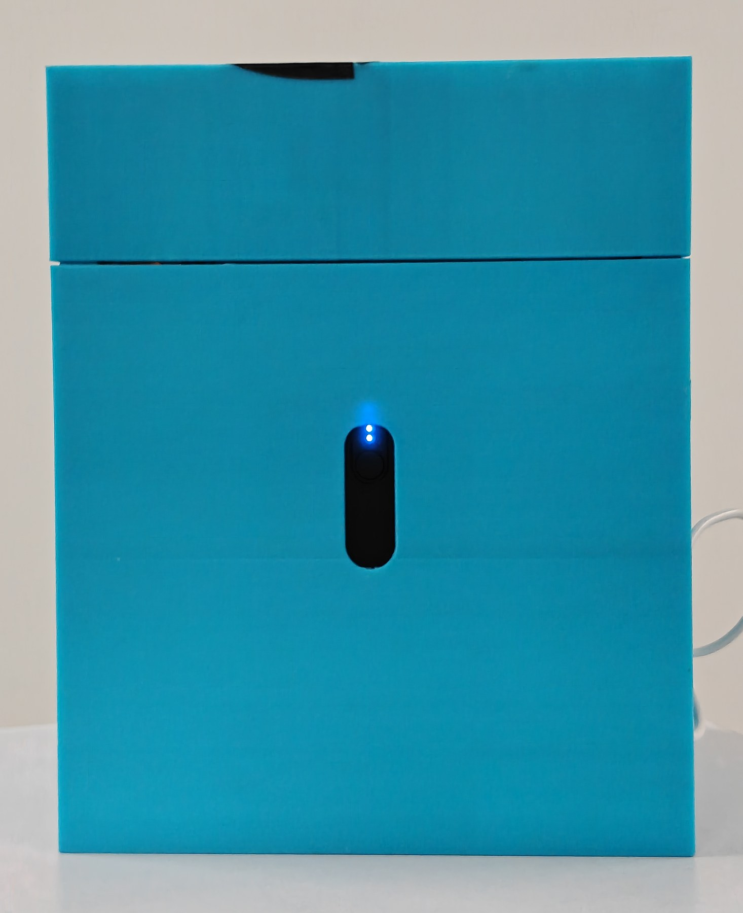
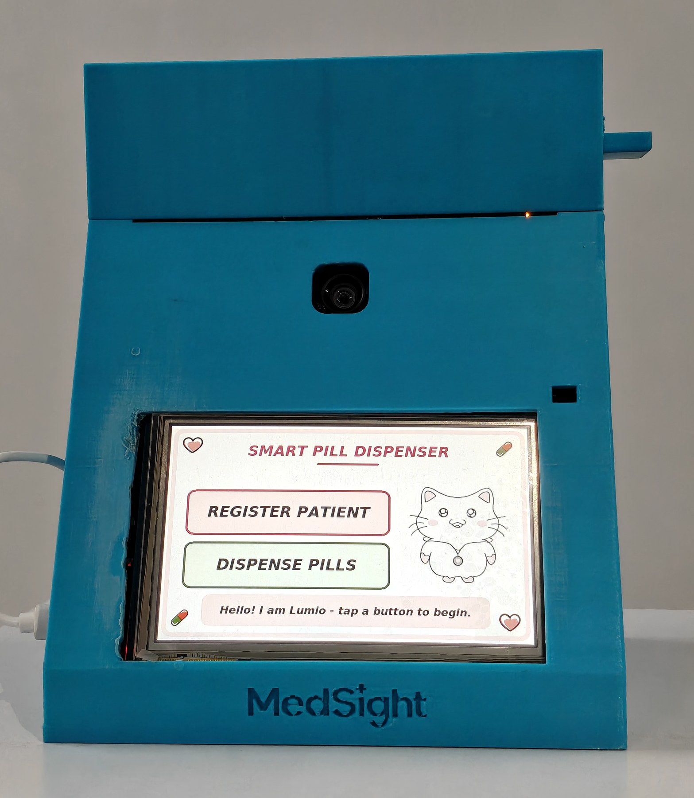
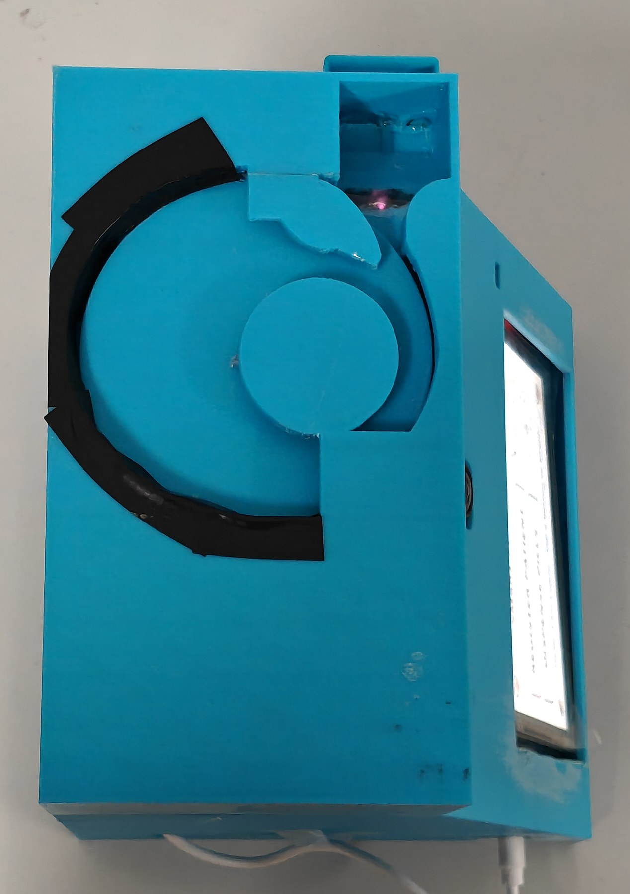

# MedSight

**An offline medication dispenser that recognises the patient by face and counts
every pill physically leaving the turntable.**

TRON Programming Contest 2026 · RTOS Application category
Entry 54916 · Applicant: Dousik Manokaran

Source code and everything else: **github.com/M-DOUSIK/MedSight**

---

What the device is, how it works, how to run it, how to build and flash it,
and the planned work.

| Part | | |
|---|---|---|
| **1** | System overview | the problem, and what the device does about it |
| **2** | The dose sequence | five stages, end to end |
| **3** | The neural networks | four networks on the accelerator, no cloud |
| **4** | RTOS architecture | six tasks, and the kernel primitives in use |
| **5** | Hardware architecture | wiring, printed parts, specifications |
| **6** | Quick start | ninety seconds, no computer |
| **7** | Operation | every screen and every flow |
| **8** | Building and flashing the firmware | ST-LINK, step by step |
| **9** | Troubleshooting | fault diagnosis |
| **10** | Current limitations and planned work | the roadmap |

---

## Part 1. System overview

### The problem

**Between a fifth and a half of older patients do not take their long-term
medication as prescribed.** The range is **21-55%**, from a 2026 systematic
review of older adults facing treatment burden (Amato et al.), and a second
2026 review across **128 studies** searched to the end of 2024 finds the
problem no less stubborn (Scotti et al.). On dispensing data rather than
self-report, an analysis of **42,601 records** for patients over 65 lands in
the same place (Cardona et al., 2025). The familiar line that adherence
averages 50% comes from the WHO's 2003 review; that report established the
baseline and is cited here for that, not as a current measurement.

In residential care it fails differently, and worse. A study of **256 residents
across 55 care homes** found **69.5% had at least one medication error**, at a
mean of 1.9 errors each, with residents taking a mean of 8 medicines. The causes
named were not carelessness: high staff workload, lack of medicines training,
**drug round interruptions**, paper records, and administration systems that are
hard to fill and hard to check.

This is getting larger everywhere. **By 2030 one person in six worldwide
will be 60 or over**, and that population doubles to 2.1 billion by 2050 (World
Health Organization, October 2025). Care work is the constraint on top of it:
the same body projects a shortfall of about **11 million health workers by
2030**, concentrated in low- and lower-middle-income countries.

Most pill organisers are passive. A labelled box does not know who opened it, or
whether anything was taken.

### What the device does

A carer enrols a patient once: their face, their name, how many pills they take
at a time, and up to four times of day. That takes about two minutes and it
happens behind a passcode.

From then on the device runs on its own. It reminds the patient when a dose is
due. It checks who is standing in front of it, by face, using its own neural
processor. It turns a motorised turntable and **counts each pill as it
physically passes an infrared sensor**, so the number on screen is a
measurement rather than an assumption. It runs action recognition over the
confirmation window. And it writes every one of those events to a memory card that a carer
can read back on the device itself.

One device, many patients. Each one is recognised by face and carries their own schedule, up to four dose times a day. One medication per turntable.

### How it differs from existing dispensers

**It counts, rather than assumes.** Any dispenser can turn a motor for a fixed
time and hope the right number of pills came out. This one has a sensor in the
chute, and the progress bar on screen steps once per pill it actually detects.
If three pills come out when four were asked for, the record says three.

**It knows who it is dispensing to.** Face recognition runs entirely on the
board, on a dedicated neural processor, in **209 ms**. Nothing is uploaded and
no photograph is stored: what is kept is a mathematical fingerprint of the face,
not the picture that produced it.

**It runs on its own.** Signed firmware in the board's external flash, its own
battery in the back of the housing, no computer anywhere. It is a device, not a
demo.

**It does not need anyone's servers.** A dispenser with a companion app and an
account necessarily moves the adherence record off the device and onto somebody
else's machine. This build has no radio at all, so the record stays on the card
in the device.

---

## Part 2. The dose sequence

Five steps. The fourth is the one that matters.

| | | |
|---|---|---|
| **1** | **The window opens** | A µT-Kernel alarm handler fires exactly once. The home screen names the patient and the time; three short beeps. |
| **2** | **Identification** | CenterFace detects the face, MobileFaceNet encodes it as a 128-dimension embedding, and it is matched against the enrolled gallery by cosine similarity. **209 ms**, every time. |
| **3** | **Dispense** | The turntable turns. Each pill passes the infrared sensor on its way down the chute. Measured pulse: **17-46 ms**, because pills slide rather than fall. |
| **4** | **Counted, not timed** | The progress bar steps **once per counted pill**. Pill 3 of 6 is a half-full bar reading 50% because three pills were actually counted. |
| **5** | **Confirmation** | Action recognition observes the window. The patient's press of the large green button remains the confirming action. One record goes to the card. |

**Why step 4 is the one that matters.** With the mechanism attached the bar
advances on each sensor pulse, so it reports what the hardware actually did. A
timed animation exists only in the simulation build, where
`MEDSIGHT_PHYSICAL_DISPENSER` is 0 and there is no sensor to read. That is also
why the audit line records the count that actually came out:

```
DISPENSE: <patient> <n> requested, <m> counted (OK)
```

written once, after the outcome is known, so the log never contains two claims
about one event.

**If a dose goes wrong**, neither outcome is treated as a system fault, because
a mechanical device jamming is normal:

- **JAM** - 25 seconds with nothing counted at all. Nothing was released.
- **SHORT** - some pills, then 25 seconds of silence. The turntable needs refilling.

The 25 seconds measures **time since the last counted pill**, so a working
mechanism can take as long as it needs and a stopped one is caught in one
window.

---

## Part 3. The neural networks

Four neural networks run on the board's Neural-ART accelerator. Nothing is sent
anywhere.

| Network | What it decides | Origin |
|---|---|---|
| **CenterFace** | Detects a face and emits five landmarks with it, both mouth corners among them | STMicroelectronics |
| **MobileFaceNet** | Encodes the face crop as a 128-dimension embedding for cosine matching | STMicroelectronics |
| **MediaPipe hand landmarks** | 21 keypoints, giving the fingertip position during the confirmation window | Google, via ST's model zoo. We selected it, quantised it, compiled it to the NPU and integrated it. We did not train it |
| **Pill detector** | Single-class detection in a mouth-centred region. Corroboration only | **Trained by this team** |

The pill detector was trained here on a public pill dataset, exported, and
adapted to the accelerator: the convolutional body runs as 8-bit integer on the
NPU and the YOLO decode runs on the Cortex-M55. It corroborates and does not
decide, because at the deployment distance a pill is about an 8-pixel object
and per-frame detection is around 7%. On the validation set the 8-bit model
matches
the floating-point model it was trained from.

**Everything around the face networks is our code too**: the frame snapshot, the
box decode, the normalisation, the 8-bit quantisation of the fingerprint, the
cosine matching against the gallery, and writing it to the card.

**One measurement worth keeping.** The hand model scores 0.0078 on a face, never
goes above 0.035 across 400 random images, does not fire on an ear waved
deliberately in front of it, and scores about 0.50 on a hand at the mouth. Four
rounds of simpler skin-colour heuristics could not separate a moving ear from a
hand; a model that knows what a hand is settled it in one step.

---

## Part 4. RTOS architecture

This is entered in the RTOS Application category, judged on real-time
performance, power saving and memory footprint. The answer is not "we used an
RTOS".

| | |
|---|---|
| **89.6%** | of wall-clock time asleep in `WFI`, waking about 980 times a second |
| **85.6% / 63.0%** | of the code and data regions used, leaving 147 KB and 378 KB free |

### Kernel primitives in use

| Primitive | What it does here |
|---|---|
| `tk_cre_tsk` | **Six tasks**, priorities derived rate-monotonically: shortest period gets the highest priority, each number justified in writing. The AI task sits *below* the interface deliberately, which is what keeps touch and the physical button alive while the accelerator works |
| `tk_cre_flg`, `tk_wai_flg` | **Inference is dispatched through an event flag.** The interface's wait has three outcomes to tell apart in one blocking call: face found, no face, or the AI task never answered. A queue, a semaphore or a mutex cannot say that. The payoff is behavioural: the interface used to freeze inside the neural processor for seconds |
| `tk_cre_alm`, `tk_sta_alm` | **Dose scheduling is an alarm handler**, not a task polling the clock. Polling would wake 8,640 times a day in order to act four times, and would spend the power figure above doing it. The handler sets one bit and returns; every line of real work happens in a task |
| `tk_cre_mbf`, `tk_cre_mtx` | The logger's queue, so no caller ever waits on an SD write, and the firmware's one mutex: the clock, which has two readers |
| `low_pow()` | The vendored board support package ships its idle hook **empty**. Ours executes `WFI` and accounts for the cycles, which is where the 89.6% comes from |

**One file talks to the kernel.** Every call above lives in `ms_osal.c`, behind
an abstraction the rest of the firmware was written against, so the kernel's use
is deliberate and in one place rather than scattered. The vendored kernel itself
is unmodified except for six files out of about 230, none of which implements a
system call.

**Two idioms were evaluated and deliberately not adopted**, with the reasoning
written down: a fixed-size memory pool, because this firmware has no fixed-size
runtime allocation site at all and adopting one would have meant inventing an
allocation in order to have something to pool; and an event flag for the confirm
state, because all three of its conditions are produced by the task that would
wait on them. Neither would have done any work.

---

## Part 5. Hardware architecture

### Wiring and interconnects


**Eleven jumper wires**, plus the motor's own keyed 5-pin plug into the driver
board. No resistors, no transistors, no level shifters, no external regulator.

| Wire | Board label | MCU pin | To |
|---|---|---|---|
| 1 | `D3` | PE9 | ULN2003 `IN1` (coil A) |
| 2 | `D5` | PE10 | ULN2003 `IN2` (coil B) |
| 3 | `D6` | PE13 | ULN2003 `IN3` (coil C) |
| 4 | `D9` | PE14 | ULN2003 `IN4` (coil D) |
| 5 | `5V` (CN8) | - | ULN2003 terminal `+` |
| 6 | `GND` (CN8) | - | ULN2003 terminal `-` |
| 7 | `D2` | PD0 | IR module `OUT` (interrupt, both edges) |
| 8 | `5V` (CN8) | - | IR module `VCC` |
| 9 | `GND` (CN8) | - | IR module `GND` |
| 10 | `D10` | PA3 | piezo `+` |
| 11 | `GND` (CN8) | - | piezo `-` |

**Wire by the silkscreen label** printed on the board, not by the colour in the
drawing. The colours above are that drawing's own convention.

`D14` and `D15` are the camera's I2C and must stay clear.

### Power

One 5 V source, one ground.


Running the driver from the board's own `CN8 5V` was tested under motor load and
is the recommended arrangement, because it makes a shared ground structural
rather than something you have to remember. A split USB cable feeding the driver
straight from the battery pack works too, **but its ground must still return to
CN8 `GND`** - a driver whose ground floats will not switch, and it looks exactly
like a dead driver.

### The printed parts


*Rendered from the STL files that go to the printer. The callout numbers are:*

| | |
|---|---|
| **01 Board enclosure** | 1 housing shell, 2 port and connector grid, 3 battery compartment, 4 MedSight brand plate |
| **02 Pill dispenser** | 1 enclosure box, 2 rotating carousel, 3 central drive motor hub, 4 dispensing chute, 5 output collection drawer, 6 side sensor brackets, 7 internal divider wall |
| **03 Structural pillars** | 1 structural pillar, eight off |

| Part | Size |
|---|---|
| Board enclosure | **164 x 153 x 152 mm** - sloped front face, rear battery compartment |
| Pill dispenser | **179 x 92 x 50 mm** - carousel, motor hub, chute, collection drawer, sensor brackets |
| Structural pillars, 8 off | **180 x 100 x 10 mm** |

**The chute geometry is what makes the counter work.** Pills slide rather than
free-fall, which is why detection pulses measure 17-46 ms instead of the few
milliseconds a drop would give. A driver sized for a free-fall would have thrown
away every real pill.

**One sensor, and a threshold set from measurement.** The module is a
reflective infrared proximity sensor: a pill passing in front of it returns
enough light to pull the output low, and the output is digital, so the
in-or-out decision is made in the sensor rather than in software. What that
costs is honest to state: how strongly a pill returns light depends on its
colour and finish, which is why the discrimination floor was set from measured
pulse durations rather than assumed.

### Specifications

| | |
|---|---|
| **Processor** | Arm Cortex-M55 at 800 MHz, STM32N657X0H3Q |
| **AI accelerator** | ST Neural-ART at 1 GHz, about 600 GOPS |
| **Networks on it** | 4 |
| **Memory** | ~4.2 MB on-chip SRAM · 1 Gbit external NOR for weights · 256 Mbit PSRAM |
| **Firmware size** | 85.6% of the code region, 63.0% of the data region |
| **RTOS** | µT-Kernel 3.0, six tasks |
| **CPU idle** | ~89.6% in `WFI` |
| **Display** | 5 inch, 800 x 480, capacitive touch |
| **Camera** | Sony IMX335 |
| **Storage** | microSD. The only storage in the device |
| **Clock** | internal RTC, kept across resets in the backup domain |
| **Actuator** | 28BYJ-48 stepper, half-step, 2 ms per step |
| **Pill sensor** | infrared proximity, both edges, 8 ms discrimination floor |
| **Audio** | active piezo, five patterns |
| **Power** | 5 V USB-C. Runs on its own battery, with no mains supply and no computer |
| **Capacity** | multiple patients, 4 dose times each, 1-10 pills per dose, 1 turntable. The gallery size is a build constant, `MAX_PATIENTS`, set to 10 in this build |

### Measured performance

| | |
|---|---|
| Face recognition, end to end | **209 ms**, identical to the millisecond across four captures |
| Hand-landmark inference | 285-302 ms |
| Pill detector, quantisation | 8-bit matches floating point on the validation set. At the deployment distance, per-frame detection is about 7% |
| **Dispense accuracy** | 4 trials: 5/5, 3/3, 3/3, 2/2. All 13 pills counted. A small sample, not a reliability figure: the mechanism has miscounted and jammed outside these trials |
| Longest legitimate detection pulse | 1210 ms |
| Battery operation | one complete dispense on battery, no laptop |

The 209 ms is the same on every capture: four faces, four detector
confidences, one timing. The accelerator runs a fixed schedule for a fixed
input size, so the cost does not depend on the picture.

---

## Part 6. Quick start

**No computer. About ninety seconds.**

If the dispensing hardware is damaged or missing, skip to 8.9: the whole
application runs without it, with the dispense shown on screen.

1. **Check the two settings on the board.** Both ship correct and neither
   needs a tool:
   - `SW1 (BOOT1)` must be **LOW**.
   - The **power-source jumper on the underside of the board** must be on
     **USB-C**, not `STLK` and not `VIN`. This is the one that catches people:
     on `STLK` the board takes its power from the debugger, so the battery
     does nothing and the device looks dead.
2. **Check the battery cable is connected.** The cable lives inside the
   housing and is normally left plugged in: USB-C into `CN6` on the board, the
   other end into the battery in the rear compartment. If it has come loose,
   connect it.
3. **Press the power button on the back.** It is the battery's own button,
   brought out through the back panel, and it glows while the battery is
   supplying power. **One press turns the device on. Two presses in quick
   succession turn it off.**

   

   *The back of the device. The button is the only control on this face.*

4. Wait about ten seconds. The home screen appears: a teal bar reading
   **SMART PILL DISPENSER**, two large buttons, and an animated cat.
5. Tap the amber **DISPENSE PILLS**, then **I AM READY**.
6. **Look at the camera.** A live preview, then the screen goes flat pink for
   about three quarters of a second. **That pause is the neural processor
   running and it is deliberate** - its working memory overlaps the display
   buffer, so the screen is switched off rather than left showing raw tensor
   data. It is a pause, not a fault.
7. The device greets the patient **by name** and shows the exact image it ran
   on, with the detector's box and five landmarks drawn on it. Tap **NEXT**.
8. **Watch the dispense.** The turntable turns, each pill passes the sensor,
   and the bar steps once per counted pill. Two short beeps on success.

**The unit as shipped has no memory card fitted.** The card is supplied in the
packet with the pills. Its slot is on the board, inside the housing, so fitting
it means opening the enclosure. Until it is fitted the home screen says so in
those words: *No SD card - doses are not being recorded. The device still works
normally.* Everything described in this handbook runs without it. What does not
survive a power cycle is the enrolled gallery, the dose history, and any change
to the carer passcode; fit the card and all three persist.

**Two LEDs tell you the RTOS is alive.** The green one toggles once per
iteration of the 1 ms camera task, so at about 500 Hz your eye reads it as a
steady dim glow. The red one toggles every 500 ms in the idle task, a 1 Hz
blink. Both ends of the priority range, visibly running, on battery.

---

## Part 7. Operation



*Everything in this part happens on this screen. The camera is the small lens
above it; the dose arrives in the drawer below.*

### 7.1 Carer mode

**The passcode is `1234`.** It is a build-time default, the device says on every
boot that it is still on the default, and it can be changed.

**To get in:** tap the **title bar**, the coloured strip across the top of the
home screen, **five times within three seconds**, then type the passcode.

The title bar is the target because it is the one thing on that screen that is
unmistakably not a button, so nobody taps it five times by accident. Any tap
elsewhere resets the count.

### 7.2 A ten-minute evaluation

| # | Step | How | Expected |
|---|---|---|---|
| 1 | Power on | battery pack to `CN6` | home screen |
| 2 | Enter carer mode | title bar x5 in 3 s, then `1234` | **CARER MODE** menu |
| 3 | Set the clock | `SET CLOCK`, twelve digits `DDMMYYYYHHMM`, `OK` | "Clock set." |
| 4 | Leave carer mode | `EXIT` | home screen, schedule armed |
| 5 | Register a patient | `REGISTER PATIENT`, `1234`, `I AM READY`, type a name, `DONE`, face the camera, `NEXT`, set pills per dose, `NEXT`, `CONFIRM` | "Registered!" |
| 6 | Set a schedule | carer mode, `PATIENTS`, the name, `DOSE TIMES`, tap a slot, four digits, `OK`, `SAVE` | "Dose times saved." |
| 7 | Dispense | home, `DISPENSE PILLS`, `I AM READY`, face the camera, `NEXT` | greeted by name; bar steps per pill; two beeps |
| 8 | Confirm | the large green **I TOOK IT!** | "THANK YOU!" |
| 9 | Read the log back **on the device** | carer mode, `REVIEW LOG` | the last few lines. **Missed doses are the one line that is not grey** |

**Step 5 is worth watching for one detail.** The passcode is asked **before the
camera is ever used**. Asking afterwards would mean a face and a name had
already been taken from somebody who was never authorised to give them.

### 7.3 Registering somebody

`REGISTER PATIENT`, passcode, `I AM READY`, type the name, `DONE`, the person
looks at the camera, `NEXT`, set the pill count, `NEXT`, `CONFIRM`.

The name is asked **before** the photograph on purpose: being photographed by a
machine that has not yet asked who you are is the wrong way round.

**Enrol in the light the device will be used in.** This is the single most
useful thing you can do. One test round measured match scores of **57 to 88 for
the same person** under varying illumination, rejecting them about one time in
three. That is a property of one-shot face recognition, not a fault, and the
retry screen rescued every case - but a demo filmed in different light from the
enrolment will show that retry screen.

### 7.4 The clock

**Set it first on a new device.** The device has no network, so it cannot set
its own clock, and a wrong clock gives doses at the wrong time with an audit
trail that says it was right.

Carer mode, `SET CLOCK`, twelve digits: day, month, year, hour, minute. For
7 March 2027 at 08:30, type `070320270830`. An impossible entry names the field
that is wrong rather than just saying invalid.

### 7.5 Dose times and dose size

**Dose times:** carer mode, `PATIENTS`, the name, `DOSE TIMES`. Four slots. Tap
one, type four digits, `OK`, `SAVE`.

**Dose size:** carer mode, `PATIENTS`, the name, `DOSE SIZE`, `-` and `+`, one
to ten, `SAVE`. This is how many pills at once, not how many are in the machine.

### 7.6 Refilling

The turntable is open from above. Lay pills loose on it. They do not need
arranging: the guides singulate them as the disc turns.



*The turntable, from above. Pills lie in a single layer and the guide feeds
them to the chute one at a time.*

**The device does not track how many pills are on the turntable**, and that is
a decision rather than an oversight: it has no way to know when a carer tops it
up, so rather than keep a number that would quietly go wrong, it keeps none. So
**check the turntable on a routine, not when the device asks.**

**If it jams or loses power, open the housing and take the dose out by hand.**
The case does not lock and nothing holds the pills in. A machine must never
stand between somebody and their medication.

### 7.7 The dose history

Carer mode, `REVIEW LOG`.

| Line | Meaning |
|---|---|
| **DISPENSE** | pills came out, and how many were counted |
| **CONFIRMED** | the patient pressed I TOOK IT |
| **SKIPPED** | the patient pressed Skip |
| **MISSED** | a window opened and closed with nothing dispensed |

Missed doses are shown in colour; everything else is grey.

### 7.8 Audio patterns

| Sound | Meaning | For |
|---|---|---|
| One very short blip | you tapped something | whoever is tapping |
| **Two short beeps** | the dose came out correctly | the patient |
| **Four quick short beeps** | jam, or the turntable is empty | whoever is there |
| **Three pairs of short beeps** | pills are due now | the patient |
| **Four long beeps, twice** | **a dose was missed** | **the carer** |

**Only the missed-dose alert uses long tones, and that is deliberate.** The
reminder is polite because it fires on schedule when nothing is wrong. The
missed-dose alert is insistent because by then something is, and it is aimed at
a **carer**, not the patient: somebody who has already not responded to a
reminder does not need to be beeped at harder. The long beeps exist to bring a
carer to the device.

### 7.9 Removing somebody

Carer mode, `PATIENTS`, the name, `DELETE`, `DELETE` again.

This removes their name **and** their face data together. A partial delete would
defeat the point: a record with a cleared name and a live fingerprint still
matches a face, it just matches it to nobody.

**The confirmation screen times out to KEEP.** Every other timeout in this
interface goes forward; this one goes back, because that is the only correct
default for something you cannot undo.

### 7.10 The camera during the confirm screen

The camera runs for up to 30 seconds on the **TAKE YOUR PILL NOW** screen,
looking for a hand going to the mouth.

**No picture is ever saved**, to the card or anywhere else. What survives is a
few words in the history.

Nothing on screen announces this, deliberately: a warning on the one screen
where somebody is being asked to do something simple risks distracting them
from doing it. **A person being watched by a camera should still be told, so
tell the patient and their family.**

---

## Part 8. Building and flashing the firmware

Every command here was actually run.

**What you are building.** This firmware starts from ST's STM32N6 example
application and replaces its core. µT-Kernel 3.0 is the RTOS, reached through
an abstraction layer written for this project; six vendored kernel files differ
from upstream and every file implementing a system call is byte-identical. The
OS abstraction layer, the 22-screen user interface and its design system, the
state machine, carer mode, the scheduler and time source, the SD logger and the
block-device layer beneath FatFs, the dispenser driver and the alert path are
original MedSight code. Four neural networks were selected, quantised, compiled
to the accelerator and integrated. Every third-party component, its rights
holder and its licence are inventoried in
[`THIRD_PARTY_SOFTWARE.md`](THIRD_PARTY_SOFTWARE.md).

### 8.1 What you need

**STM32CubeIDE 2.1.1** or newer. **There is no `.ioc` file**: every peripheral
is configured in code rather than generated, so there is nothing to
regenerate.

`STM32_Programmer_CLI` and `STM32_SigningTool_CLI` ship inside CubeIDE, with the
external loader `MX66UW1G45G_STM32N6570-DK.stldr` beside them. Set these once
per PowerShell session:

```powershell
$BIN    = "C:\ST\STM32CubeIDE_2.1.1\STM32CubeIDE\plugins\com.st.stm32cube.ide.mcu.externaltools.cubeprogrammer.win32_2.2.500.202603051304\tools\bin"
$CLI    = "$BIN\STM32_Programmer_CLI.exe"
$SIGN   = "$BIN\STM32_SigningTool_CLI.exe"
$LOADER = "$BIN\ExternalLoader\MX66UW1G45G_STM32N6570-DK.stldr"
```

Your plugin folder's version suffix will differ. `dir "$BIN\.."` to find it.

### 8.2 The one rule for external-loader operations

> **After any external-loader operation, unplug the USB cable.**
>
> Not a reset. Not the IDE's stop button. The cable, out, for a few seconds.

Back-to-back operations through the external loader leave the flash chip's bus
state confused. The symptom is a boot that hangs where the external flash is
first touched: the log stops right after `ai_vision_init: DEBUG build (-O0).`
and the screen holds a stale frame. **The flash contents are fine**; only the
peripheral's bus state needs clearing.

**This applies to reads as well as writes.** A verification read leaves the bus
in the same state a write does, and a read is exactly when it is most tempting
to leave the board running.

### 8.3 Boot switches

| Mode | SW1 (BOOT1) | SW2 (BOOT0) | |
|---|---|---|---|
| **A, development** | **HIGH** | LOW | waits for the debugger, gives you the log |
| **B, standalone** | **LOW** | LOW | runs from external flash, no computer |

Mode A is the factory position and is enough to evaluate every software feature.

### 8.4 Build

Import `firmware/STM32CubeIDE/FSBL` and build **Debug**. Expect **0 errors, 0
warnings**.

Headless:

```powershell
& "C:\ST\STM32CubeIDE_2.1.1\STM32CubeIDE\stm32cubeidec.exe" --launcher.suppressErrors -nosplash `
  -application org.eclipse.cdt.managedbuilder.core.headlessbuild `
  -data <a scratch workspace dir> `
  -import "firmware\STM32CubeIDE\FSBL" `
  -cleanBuild "MedSight_FSBL/Debug"
```

On Windows the `-import` path **must use backslashes**; a forward-slash path
with a drive letter is parsed as a URI scheme and fails.

### 8.5 Flash the neural network weights

**The firmware does not contain its neural network weights.** The linker marks
those external flash regions as not-to-be-loaded, deliberately, so building and
flashing the application never writes them.

A fresh clone therefore compiles a perfectly good binary, flashes it, and
produces a device whose face recognition and pill detection **both output
nonsense, with nothing in any log to say why.**

Five images, once per board:

```powershell
& $CLI -c port=SWD mode=UR -el $LOADER -w "weights\fd_data.xSPI2.bin"       0x70380000
& $CLI -c port=SWD mode=UR -el $LOADER -w "weights\ec_blobs.xSPI2.bin"      0x71000000
& $CLI -c port=SWD mode=UR -el $LOADER -w "weights\faceid_data.xSPI2.bin"   0x72000000
& $CLI -c port=SWD mode=UR -el $LOADER -w "weights\hand_atonbuf.xSPI2.bin"  0x73000000
& $CLI -c port=SWD mode=UR -el $LOADER -w "weights\pill_atonbuf.xSPI2.bin"  0x73400000
```

**Then unplug the cable** (see 8.2).

| Region | Address | What |
|---|---|---|
| `fd_data` | `0x70380000` | face detector weights |
| `ec_blobs` | `0x71000000` | accelerator microcode |
| `faceid_data` | `0x72000000` | face embedder weights |
| `hand_atonbuf` | `0x73000000` | hand landmark model |
| `pill_atonbuf` | `0x73400000` | the pill detector we trained |

SHA-256 prefixes for all five are in `weights/README.md`, so a mis-copied file
is caught before it becomes a debugging session.

**Use `mode=UR`, not `mode=HOTPLUG`.** HOTPLUG needs a live, responsive core,
and with MedSight running the erase fails outright, because the application has
the external flash memory-mapped while the loader wants the same bus in indirect
mode.

### 8.6 Flash the application

**Move the power-source jumper on the underside of the board to `STLK` first**,
so the board is powered by the debugger while it is being programmed. Move it
back to **USB-C** before running on the battery. It is the same jumper the
quick start mentions, and it is the usual reason a flash or a standalone boot
fails for no visible cause.

In the IDE, press **Run**. The launch configuration is committed and needs no
editing. From a terminal instead:

```powershell
& $CLI -c port=SWD -w "firmware\STM32CubeIDE\FSBL\Debug\MedSight_FSBL.elf" -rst
```

**Use `-rst`, a software reset.** An explicit go-to-address was tried and did
not reliably produce a running application on this board. This command never
touches external flash, so it is the fast every-edit loop.

### 8.7 Watch the log

ST-LINK virtual COM port, **115200 8N1**. A correct boot says, in order:

```
ai_vision_init: face detector + embedder ready.
ARENA SELFTEST PASS: 225280 bytes writable and readable
intake: hand landmark model ready (MediaPipe 224x224 INT8, 21 keypoints, ...)
intake: pill detector ready (YOLOv8n 160x160 INT8, head cut, decode on CPU).
dispenser: ...
buzzer: active piezo on PA3 (Arduino D10), keyboard click off
task_camera_isp: started.
```

**If detection runs but the numbers are meaningless, suspect a weight region
before you suspect the code.** A missing or wrong weight image does not announce
itself as an error: the network initialises cleanly and returns nonsense.

### 8.8 Standalone boot

**Why it takes two stages.** The STM32N6 has **no internal flash**. Its boot ROM
copies a first-stage loader from external flash into RAM, and that copy is
**capped at 512 KB**. MedSight is about 880 KB, so it can never *be* the first
stage.

| Stage | What | Address |
|---|---|---|
| 1 | ST's prebuilt loader (`ai_fsbl.hex`) | `0x70000000` |
| 2 | MedSight, signed as second stage | `0x70100000` |
| - | Neural network weights, untouched | `0x70380000`+ |

**Get ST's loader.** It is **not in this repository** because it is ST's binary,
not ours. Download **X-CUBE-N6-AI-POWER-MEASUREMENT** v1.4.0 or newer and take
`FSBL/ai_fsbl.hex`. The copy verified against:

```
sha256  8fa77dcdcb9aeed6e167c1ce5ffe9e16071fdeced8d13e22edd31a37abed1993
size    176,541 bytes
```

**Sign the application.** From `firmware/STM32CubeIDE/FSBL`:

```powershell
Remove-Item -Force "Debug\MedSight_ssbl.bin" -ErrorAction SilentlyContinue
& $SIGN -bin "Debug\MedSight_FSBL.bin" -nk -t ssbl -hv 2.3 -la 0x34000000 -align -o "Debug\MedSight_ssbl.bin"
```

| Flag | Why |
|---|---|
| `-t ssbl` | **second** stage. `-t fsbl` produces an image the ROM can never load, because of the 512 KB cap. Getting this wrong costs an afternoon, so it is worth checking twice |
| `-hv 2.3` | the boot header version the ROM expects |
| `-la 0x34000000` | load address, must match the linker script |
| `-nk` | no signing key; the board is not in a secured state |
| `-align` | pad to the alignment the loader requires |

**Flash both stages:**

```powershell
& $CLI -c port=SWD mode=UR -el $LOADER -w "<path>\ai_fsbl.hex"
& $CLI -c port=SWD mode=UR -el $LOADER -w "Debug\MedSight_ssbl.bin" 0x70100000 -v
```

**Use `-v`. Verify the whole file.** Do not check a few bytes of a magic number
and call it confirmed: during bring-up that produced a "verified" write that had
not happened, because both candidate images shared those bytes.

**Then unplug the cable**, set **SW1 LOW**, and power it from anything 5 V. To
get back to Mode A, set SW1 HIGH; nothing is erased.

### 8.9 Running with no dispensing hardware

Fully supported, and it is how a reviewer without a stepper motor should build
this. In `firmware/FSBL/Inc/dispenser.h`:

```c
#define MEDSIGHT_PHYSICAL_DISPENSER 0
```

Rebuild. Everything except the physical dispense still runs - face
recognition, scheduling, carer mode, the audit log, all 22 screens - and the
dispense itself is shown on screen instead of turned by a motor.

Both values build with 0 errors and 0 warnings, and the no-hardware branch is
the earlier on-screen dispense kept byte-for-byte. It has been run on the
assembled board, not merely compiled, and it is the configuration to use if
the mechanism is unavailable.

### 8.10 Other switches

| Macro | File | Default | Effect |
|---|---|---|---|
| `MEDSIGHT_PHYSICAL_DISPENSER` | `Inc/dispenser.h` | `1` | `0` = no hardware needed |
| `MEDSIGHT_ACTION_RECOGNITION` | `Inc/ai/intake.h` | `1` | `0` removes the intake pipeline entirely |
| `MEDSIGHT_INTAKE_SIMPLE` | `Inc/ai/intake.h` | `1` | `0` restores the full guarded intake state machine |
| `MS_COIL_PINSET` | `Src/dispenser.c` | `1` | `0` selects an alternative coil pin set |
| `MS_DISPENSE_DIRECTION` | `Src/dispenser.c` | `(-1)` | Anticlockwise. `1` reverses it |
| `MS_NO_PILL_TIMEOUT_MS` | `Src/dispenser.c` | `25000` | how long with no counted pill before JAM or SHORT |
| `MEDSIGHT_FAST_CLOCK` | build config | Debug `1` | compresses a day into 24 minutes, so a dose window lasts 30 real seconds |

**Demo mode is worth knowing about.** With `MEDSIGHT_FAST_CLOCK`, one simulated
minute is one real second, so a window opening, being met, and a later one being
missed all fit in one sitting. Release is the honest wall-clock build, and
nothing above the time source knows which is behind it.

---

## Part 9. Troubleshooting

### Device messages

| The screen says | What happened | What to do |
|---|---|---|
| **JAM** | 25 s with nothing counted. Nothing was released | Open the housing, check the turntable and chute. Give the dose by hand |
| **NOT ENOUGH PILLS** | Some pills, then 25 s of nothing | Refill the turntable. **Check how many the patient actually got**: the log records what really came out |
| **No memory card** | Card missing or not seated | Power off, reseat, power on. Nothing is recorded while this shows |
| **The clock has never been set** | Exactly that | See 7.4. Doses cannot be scheduled until it is set |
| **FACE NOT RECOGNISED** | The match failed | TRY AGAIN, better light, face straight on. Re-enrol in the room's own light if it persists |
| **Gallery full** | Ten already registered | Delete somebody |
| Nothing on screen, **red LED blinking about twice a second** | A startup fault. The board never reached the home screen | Most often the **camera or LCD ribbon is not seated**. Power off, reseat both, power on. See the lights table below |
| Nothing on screen | No power | Check the cable and the battery. Then check the **power-source jumper on the underside of the board**: it must be on **USB-C** to run from the battery, and on **STLK** to run from the debugger. A board on the wrong one is silent and looks broken |
| The turntable never moves, or the mechanism is damaged | The dispensing hardware is not working | **The device does not need it.** Rebuild with `MEDSIGHT_PHYSICAL_DISPENSER 0` and the whole application runs with the dispense shown on screen instead. See 8.9 |

**If the dispensing hardware is damaged or missing, nothing is lost.** One
macro and one rebuild runs the device without it, and 8.9 is the whole
procedure.

**A known intermittent, stated rather than hidden:** the memory card
occasionally fails to initialise at boot and recovers on its own. If the device
starts up saying nobody is registered, power off, reseat the card, power on. The
patients are still on it.

### Board LEDs

Two LEDs on the board say what the firmware is doing, and one of them means
the opposite of what people assume. **Blinking red is not always a fault: the
rate is the message.**

| Light | What it looks like | What it means |
|---|---|---|
| Red | **Twice a second**, evenly, forever | **A startup fault.** The board stopped before the scheduler started, so nothing else is running. Almost always the camera or the LCD ribbon not seated |
| Red | **Once a second** | **Normal.** The lowest-priority task is running, which means the whole system is scheduling correctly. This is the light you want |
| Red | Fast flicker | The camera pipeline is reporting errors while running |
| Green | Steady or fast flicker | The camera pipeline is alive and processing frames |

**The camera is not optional.** Unlike the dispensing hardware, which the
device runs without (8.9), camera bring-up is part of mandatory
startup: if the sensor does not answer, the firmware stops in its fault
handler and blinks red. A device that blinks twice a second and shows
nothing has almost certainly had a ribbon shaken loose.

### During flashing

| Symptom | Cause | Fix |
|---|---|---|
| Boot log stops after `ai_vision_init`, screen frozen | flash bus state after a loader operation | **unplug the cable** (8.2) |
| Networks initialise, outputs are nonsense | weights missing or at the wrong address | 8.5 |
| HOTPLUG connection or erase fails | MedSight is running and owns the bus | use `mode=UR` |
| Nothing boots in Mode B | signed `-t fsbl`, or wrong address | re-sign `-t ssbl`, write to `0x70100000` |
| Stepper does nothing, driver LEDs dark | ground not shared, or wrong pins | Part 5 |
| `No file system is defined for scheme: C` | forward slashes in a headless import path | use backslashes |

---

## Part 10. Current limitations and planned work

MedSight works. It dispenses real pills, counts them, recognises the patient and
keeps a record, on its own power, with no computer attached.

It is a prototype, and five things are not done yet. Each has a plan.

**One medication at a time.** One turntable means one medication, and the
record stores a count rather than a drug name. *Next:* the six to eight stacked
dispensing modules described in Part 5, plus a drug field in the patient record.
The interface already draws four medication slots with three greyed out and
labelled SOON, and the dispense function already takes a count and returns what
was counted, so the firmware change is additive. The mechanical build is the
work.

**It does not know how much is on the turntable.** The first sign of an empty
one today is a dose that comes up short. *Next, and the cheapest useful
improvement in the list:* a carer-entered "filled with N", decremented by
**counted** pills rather than assumed ones, shown as a low-stock warning. It uses
screens that already exist.

**A missed dose cannot leave the room.** There is no radio in this build, which
kept the prototype achievable and means a missed dose waits for the carer's next
round. *Next, and the top of the roadmap:* a **carer alert over Wi-Fi** and a
**patient-worn band** that signals when a dose is due. The firmware hook already
exists, since the scheduler fires exactly once per window, so the work is the
radio, the provisioning and the security design: encrypted to a known endpoint,
carrying the minimum that makes the alert actionable, with a deliberate answer
to where the record comes to rest, and behaving exactly as it does today if the
link is down.

The alerting side is planned as a **separate companion unit first**, proved on
its own before any of it is folded into the dispenser, so that a fault in a
radio can never take the dispensing path down with it. Folding it in afterwards
means a **flexible printed circuit** in place of the loose harness this
prototype uses, which is the step that turns two boxes into one product. All of
it stays under the same open licence as the rest of this work.

**The face check can be shown a photograph.** Recognition compares a face
against an enrolled fingerprint. It does not test whether the face in front of
it is a live one, so a printed photograph or a phone screen held up to the
camera would pass. In a shared room with a carer present that matters less than
it would in an unattended machine, but it is a real gap and it belongs in the
list rather than waiting to be discovered. *Next:* a liveness check on the same
camera and the same accelerator the match already runs on. This sensor gives no
depth, so the approach is the one that suits a single colour camera: a passive
test for the texture and the small involuntary motion that a flat reproduction
does not have, run on frames that are already being captured, before a match is
accepted rather than after.

**The housing does not lock.** It is a printed prototype shell, which matters
because care regulations in most places require medication to be stored locked.
The device does *withhold* - it refuses a dose outside its window and to a face
it does not recognise - but it does not *lock*. *Next:* a lockable enclosure,
tamper detection, and a vibration sensor so the log can say when the unit was
shaken. Logging is the whole response: a dispenser that stops working because it
was jostled is a hazard.

**And one thing worth being clear about.** The device counts pills leaving the
turntable and corroborates a swallowing gesture; it cannot prove somebody
swallowed, and no device of this class can. That is why the button the patient
presses remains the confirming action and the camera's verdict is evidence in
the log rather than the verdict. Face matching is likewise a similarity score
rather than an identity guarantee. Testing so far is four dispense trials, 13 of
13 pills, with no deliberately induced jam and no trial with the people the
device is designed for. That is the honest state of a working prototype, and it
is what the next round of work is for.

---

## Thank you

MedSight was built by five of us.

| | |
|---|---|
| **Dousik Manokaran** (applicant) | The firmware: the µT-Kernel migration, the six-task architecture and its priorities, the four networks on the accelerator, and this handbook |
| **Howard Nikhil** | The physical dispensing hardware: the turntable, the infrared pill counter, and the bench work the counting design rests on |
| **Gaurav V R** and **Dillimaran K** | The three-stage intake pipeline - detection, geometry, temporal decision - and the guarded state machine that refuses to certify an intake it cannot support |
| **Abirami M** | The visual identity: the mascot, and the artwork all twenty-two screens are cut from |
| **Dr. G. Santhanamari** and **Dr. D. Selvakumar** | Supervision, and two roadmap items: the vibration sensor for tamper detection, and the patient-worn alert band |

Our thanks to the **TRON Forum** for the opportunity, and for the STM32N6570-DK
board that made the second round possible. Building on µT-Kernel 3.0 at this
scale was the part we enjoyed most: the task priorities here are derived rather
than argued, the four networks run on the board's own accelerator, and every
number in this handbook came off the device.

We would like to keep going: the radio, the extra dispensing modules, and a trial with the
people this is actually for. Thank you for reading.

---

*µT-Kernel 3.0 is © TRON Forum and Ken Sakamura under T-License 2.1 / 2.2, and
the board was supplied by the TRON Forum. MedSight's own code, documentation
and CAD are Apache-2.0. Third-party components and their licences are
inventoried in `THIRD_PARTY_SOFTWARE.md`.*
